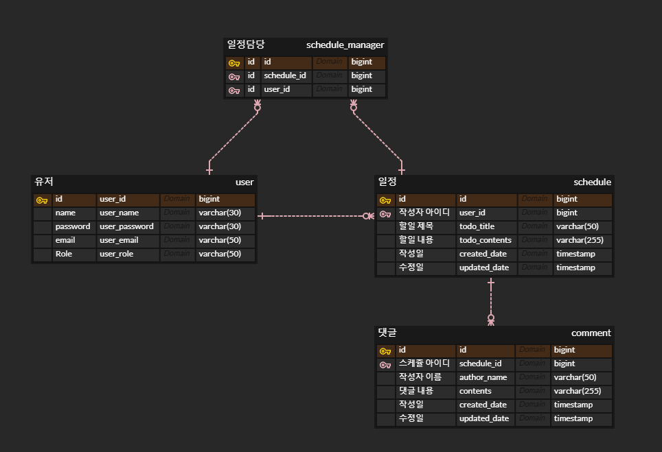

# 스프링 숙련 주차 과제

일정관리 심화버전을 만들어보자.

* **공통 조건**
    - 모든 테이블은 고유 식별자(ID)를 가집니다.
    - `3 Layer Architecture` 에 따라 각 Layer의 목적에 맞게 개발합니다.
    - CRUD 필수 기능은 모두 데이터베이스 연결 및  `JPA`를 사용해서 개발합니다.
    - `JDBC`와 `Spring Security`는 사용하지 않습니다.
    - 인증/인가 절차는 `JWT`를 활용하여 개발합니다.
    - JPA의 연관관계는 `양방향`으로 구현합니다.

# 🌐API 명세서

## 💻댓글 API

| 기능    | Method | URL                          | request | response | 상태코드     |
|-------|--------|------------------------------|---------|----------|----------|
| 댓글 등록 | POST   | /api/schedules/comments      | 요청 body | 등록 정보    | 201:정상등록 |
| 댓글 조회 | GET    | /api/schedules/comments/{id} |         | 단건 응답 정보 | 200:정상조회 |
| 댓글 조회 | GET    | /api/schedules/comments      |         | 다건 응답 정보 | 200:정상조회 |
| 댓글 수정 | PATCH  | /api/schedules/comments/{id} | 요청 body | 수정 정보    | 200:정상수정 |
| 댓글 삭제 | DELETE | /api/schedules/comments/{id} |         |          | 200:정상삭제 |

## 📆일정 API

| 기능        | Method | URL                                              | request  | response | 상태코드     |
|-----------|--------|--------------------------------------------------|----------|----------|----------|
| 일정 등록     | POST   | /api/schedules                                   | 요청 body  | 등록 정보    | 201:정상등록 |
| 일정 조회     | GET    | /api/schedules/{id}                              | 요청 param | 단건 응답 정보 | 200:정상조회 |
| 일정 조회     | GET    | /api/schedules                                   | 요청 param | 다건 응답 정보 | 200:정상조회 |
| 일정 수정     | PATCH  | /api/schedules/{id}                              | 요청 body  | 수정 정보    | 200:정상수정 |
| 일정 삭제     | DELETE | /api/schedules/{id}                              | -        | -        | 200:정상삭제 |
| 일정 담당자 등록 | DELETE | /api/schedules/{scheduleId}/managers             | 요청 body  | -        | 201:정상등록 |
| 일정 담당자 해제 | DELETE | /api/schedules/{scheduleId}/managers/{managerId} | 요청 body  | -        | 200:정상삭제 |

## 👤유저 API

| 기능    | Method | URL               | request | response  | 상태코드     |
|-------|--------|-------------------|---------|-----------|----------|
| 회원가입  | POST   | /api/users/signup | 요청 body | JWT 토큰 정보 | 201:정상등록 |
| 로그인   | GET    | /api/users/login  | 요청 body | JWT 토큰 정보 | 200:정상조회 |
| 유저 등록 | POST   | /api/users        | 요청 body | 등록 정보     | 201:정상등록 |
| 유저 조회 | GET    | /api/users/{id}   |         | 단건 응답 정보  | 200:정상조회 |
| 유저 조회 | GET    | /api/users        |         | 다건 응답 정보  | 200:정상조회 |
| 유저 수정 | PATCH  | /api/users/{id}   | 요청 body | 수정 정보     | 200:정상수정 |
| 유저 삭제 | DELETE | /api/users/{id}   |         |           | 200:정상삭제 |

# ERD

# 도커

**도커 주소**
https://hub.docker.com/r/nameless1004/spring-boot-app/tags